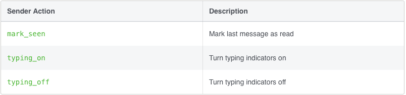

# Lesson 4.1 - Sending Sender Actions

## In theory 📖

The messenger platform provide 3 types of sender actions that simulates the real messaging experience you see when chatting with others through messenger, these sender actions are:



## Get Your Hands Dirty 👩‍💻

This one is pretty easy API request, all you need to do is to post a request with the following body data

```json
{
    "recipient": {
        "id": "<PSID>"
    },
    "sender_action": "typing_on"
}
```

in order to do this in our project, look for:

```javascript
// ToDo: Lesson 4_1
```

You will find 3 functions in the **messageSendingManager.js** file, one for each sender action, start implementing them so that each one will look like this 👇

```javascript
const sendMarkSeen = (userPSID) => {
    // ToDo: Lesson 4_1
    sendMessageThroughAPI({
        recipient: {
            id: userPSID,
        },
        sender_action: 'mark_seen',
    });
};

const sendTypingOn = (userPSID) => {
    // ToDo: Lesson 4_1
    sendMessageThroughAPI({
        recipient: {
            id: userPSID,
        },
        sender_action: 'typing_on',
    });
};

const sendTypingOff = (userPSID) => {
    // ToDo: Lesson 4_1
    sendMessageThroughAPI({
        recipient: {
            id: userPSID,
        },
        sender_action: 'typing_off',
    });
};
```

**N.B: userPSID indicates the user page scope id supported by the platform**

Easy beezy right? 😁, now run the usual command in order to check if the 3 tests associated with this lesson have turned green

```sh
./scripts/start_tutorial.sh lesson_4_1
```

<p align="center">
  
</p>

## Citation

Documentation Reference:

-   [Sender Actions](https://developers.facebook.com/docs/messenger-platform/send-messages/sender-actions)

## Next Lesson: [Lesson 4.2 - Sending Text Messages]()
