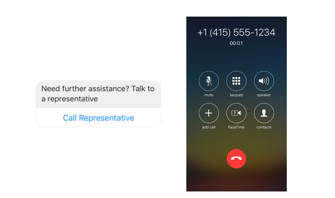

# Lesson 4.5 - Sending Button Template

## In theory 📖

The messenger platform supports a button element that you can use in different formats such as using it in:

-   Persistent menu.
-   Generic template.
-   List template (Deprecated).
-   Button template.
-   Media template.

In this lesson, we will go over the available button elements, and use it with **the Button template**. In the coming 2 lessons, we will cover the **Generic Template** & **Media Template** usages as well.

**Supported Button Types**

-   **URL Button** Opens a webpage in the messenger webview.
-   **Postback Button** Sends a messaging postback event to your webhook (the one we have discussed in [Lesson_3_1](ds))
-   **Call Button** Dial a phone number when tapped _(N.B Phone number should be in the format +<COUNTRY_CODE><PHONE_NUMBER>, e.g. +15105559999.)_
-   **Log In Button** Used in the account linking flow, where you identify your users in a web-based login flow.
-   **Log Out Button** The same flow as the Log In Button, however, it is used for account unlinking.
-   **Game Play Button** Used to launch instant game that is associated with your facebook page.



**Request Sample**

```json
{
    "recipient": {
        "id": "<PSID>"
    },
    "message": {
        "attachment": {
            "type": "template",
            "payload": {
                "template_type": "button",
                "text": "Try the URL button!",
                "buttons": [
                    {
                        "type": "web_url",
                        "url": "https://www.messenger.com/",
                        "title": "URL Button",
                        "webview_height_ratio": "full"
                    }
                ]
            }
        }
    }
}
```

## Get Your Hands Dirty 👩‍💻

The first thing we need to do in this tutorial is to implement the **buttonsTemplateManager.js**, the file responsible for creating the JSON objects that equals to each button type. You have all the functions in this manager defined, try implementing them first until all tests from this lesson goes green, then have a look at the code below for reference:

```javascript
// ToDo: Lesson 4_5
const { BUTTON_TYPES } = require('../constants/messengerPlatformConstants');

const buildWebUrlButton = (
    title,
    url,
    {
        webViewHightRatio,
        messengerExtensions,
        fallbackUrl,
        webViewShareButton,
    } = {}
) => {
    const buttonTemplate = {
        type: BUTTON_TYPES.WEB_URL,
        title,
        url,
    };
    if (webViewHightRatio)
        buttonTemplate.webview_height_ratio = webViewHightRatio;
    if (messengerExtensions)
        buttonTemplate.messenger_extensions = messengerExtensions;
    if (fallbackUrl) buttonTemplate.fallback_url = fallbackUrl;
    if (webViewShareButton)
        buttonTemplate.webview_share_button = webViewShareButton;
    return buttonTemplate;
};

const buildPostbackButton = (title, payload) => ({
    type: BUTTON_TYPES.POSTBACK,
    title,
    payload,
});

const buildCallButton = (title, phoneNumber) => ({
    type: BUTTON_TYPES.PHONE_NUMBER,
    title,
    payload: phoneNumber,
});

const buildLogInButton = (loginUrl) => ({
    type: BUTTON_TYPES.LOG_IN,
    url: loginUrl,
});

const buildLogOutButton = (logoutUrl) => ({
    type: BUTTON_TYPES.LOG_OUT,
    url: logoutUrl,
});

const buildShareButton = (shareContent) => {
    const buttonTemplate = {
        type: BUTTON_TYPES.SHARE,
    };
    if (shareContent) buttonTemplate.share_content = shareContent;
    return buttonTemplate;
};

module.exports = {
    buildWebUrlButton,
    buildPostbackButton,
    buildCallButton,
    buildLogInButton,
    buildLogOutButton,
    buildShareButton,
};
```

The second thing that we need to add is the **sendButtonsTemplate** function inside the **messageSendingManager.js**, it has almost the same implementation as the ones we have done before, only different JSON keys.

```javascript
const sendButtonsTemplate = (
    userPSID,
    displayText,
    buttons,
    { messagingType = MESSAGING_TYPES.RESPONSE } = {}
) => {
    // ToDo: Lesson 4_5
    const messageObject = {
        messaging_type: messagingType,
        recipient: {
            id: userPSID,
        },
        message: {
            attachment: {
                type: 'template',
                payload: {
                    template_type: MESSAGE_TEMPLATE_TYPES.BUTTON,
                    text: displayText,
                    buttons: buttons,
                },
            },
        },
    };
    return sendMessageThroughAPI(messageObject);
};
```

```sh
./scripts/start_tutorial.sh lesson_4_5
```

<p align="center">
  
</p>

Seems that you are getting tired and bored a little bit 🙄, cheer up, we have just few lessons left in this tutorial 😎.

## Citation

Documentation Reference:

-   [Buttons](https://developers.facebook.com/docs/messenger-platform/send-messages/buttons)
-   [URL Button](https://developers.facebook.com/docs/messenger-platform/reference/buttons/url)
-   [Postback Button](https://developers.facebook.com/docs/messenger-platform/reference/buttons/postback)
-   [Call Button](https://developers.facebook.com/docs/messenger-platform/reference/buttons/call)
-   [Account Linking](https://developers.facebook.com/docs/messenger-platform/identity/account-linking)
-   [Game Play Button](https://developers.facebook.com/docs/messenger-platform/reference/buttons/game-play)
-   [White Listing Domains for web_url Buttons](https://developers.facebook.com/docs/messenger-platform/reference/messenger-profile-api/domain-whitelisting)

## Next Lesson: [Lesson 4.6 - Sending Generic Template](Lesson_4_6.md)
