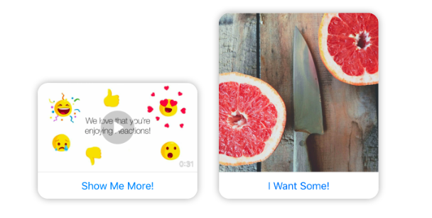

# Lesson 4.7 - Sending Media Template

## In theory 📖

Media template is a structured template the let you send an image or a video (like the image below 👇) with an optional button.

<p align="center">
  
</p>

For the JSON object that you send to the messenger platform API, it will look like this 👇

**Request Sample**

```json
{
    "recipient": {
        "id": "<PSID>"
    },
    "message": {
        "attachment": {
            "type": "template",
            "payload": {
                "template_type": "media",
                "elements": [
                    {
                        "media_type": "<image|video>",
                        "attachment_id": "<ATTACHMENT_ID>"
                    }
                ]
            }
        }
    }
}
```

In order to send a media template, the messenger platform provide you with two ways that you can use in order to deliver your media successfully, those two are:

1. Sending Media By Attachment Id.
2. Sending Media By Facebook Url.

In this lesson, we will be covering the attachment_id method, for the facebook Url one, you still gonna do it yourself in the appendix section 😁😅

<p align="center">
  
</p>

## Get Your Hands Dirty 👩‍💻

There is no much work need to be done in this lesson as we will just add a simple function implementation to the **sendMediaTemplate** found inside the messageSendingManager, this implementation will look like this 👇.

_p.s: it is ok at this stage to copy and paste the following code as long as you do understand it 😁, I know it is becoming now more and more mechanical and a little bit boring._

```javascript
const sendMediaTemplate = (
    userPSID,
    { mediaType = MEDIA_TYPES.IMAGE, attachmentId, url, buttons } = {},
    { messagingType = MESSAGING_TYPES.RESPONSE } = {}
) => {
    // ToDo: Lesson 4_7
    const element = { media_type: mediaType };
    if (!attachmentId) element.url = url;
    else element.attachment_id = attachmentId;
    if (buttons) element.buttons = buttons;
    const messageObject = {
        messaging_type: messagingType,
        recipient: {
            id: userPSID,
        },
        message: {
            attachment: {
                type: 'template',
                payload: {
                    template_type: MESSAGE_TEMPLATE_TYPES.MEDIA,
                    elements: [element],
                },
            },
        },
    };
    return sendMessageThroughAPI(messageObject);
};
```

You will notice that the code above will only use the element url when the attachmentId is undefined, this was made as a compliance to the case mentioned in the messenger platform documentation saying that attachment url only will be used if the attachmentId was not provided.

```sh
./scripts/start_tutorial.sh lesson_4_7
```

## Citation

Documentation Reference:

-   [Media Template](https://developers.facebook.com/docs/messenger-platform/send-messages/template/media)
-   [Media Template Reference](https://developers.facebook.com/docs/messenger-platform/reference/templates/media)

## Next Lesson: [Lesson 4.8 - Sending Messages Appendix](Lesson_4_8.md)
