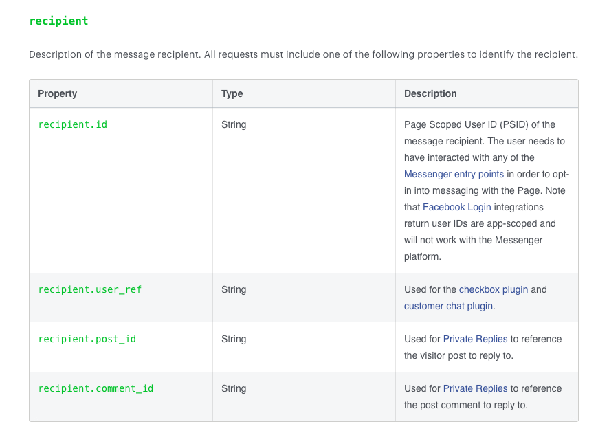

# Lesson 4.8 - Sending Messages Appendix

I know that this part was a little bit condensed and mechanical 😴, that's why I didn't want to fill it up more with advanced content especially that we are yet to experience the end to end chatbot running on the platform, hence, I will leave some topics in this appendix that you can cover later (or maybe now if you are feel energetic and able super charge your chatbot 💪🏻😁).

### Things to enhance/optimize in your chatbot in the future

1.  Covering all recipient cases.

  

2.  Using virtual personas to your thread ([reference](https://developers.facebook.com/docs/messenger-platform/send-messages/personas)).
3.  Send attachments from files ([reference](https://developers.facebook.com/docs/messenger-platform/send-messages#file)).
4.  Implementing receipt template ([reference](https://developers.facebook.com/docs/messenger-platform/send-messages/template/receipt)).
5.  [Bonus] Implement the game play button ([reference](https://developers.facebook.com/docs/messenger-platform/reference/buttons/game-play)).
6.  [Bonus] Implement account linking flow ([reference](https://developers.facebook.com/docs/messenger-platform/identity/account-linking)).

Now before moving on the next lesson where you gonna build your first chatbot on the messenger platform 🤩, I want to take a moment to celebrate your achievement reaching this far in the tutorial. I believe that **Lesson 4** is the toughest among all lessons, hence I can say that we are 90% done with this tutorial "Yaaay 🥳". Take your breath and have a moment of a self five 😅 (SOCIAL DISTANCING 🦠😷😁)

  

## Next Lesson: [Lesson 5 - Build your Super Echo Chatbot 💬🤖]()
