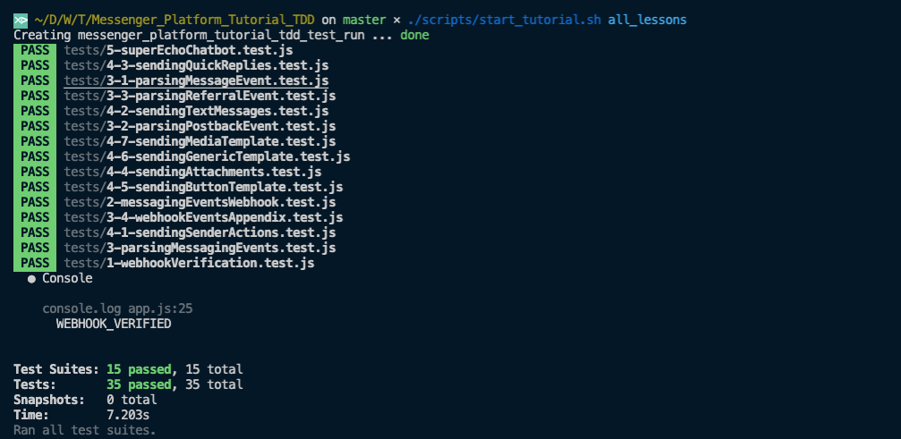

# Lesson 5 - Build your Super Echo Chatbot 💬🤖

## In theory 📖

Welcome to this final technical lesson out of this tutorial. In this lesson, we will build a chatbot that is almost a clone from the [messenger-platform-samples](https://github.com/fbsamples/messenger-platform-samples), but with our kind of logic that we have implemented in the previous lessons. Our sample will handle those 6 cases:

1.  Sends a message with quick_replies when the user sends **quick_reply**.
2.  Reply to the postback event fired by the previous quick_reply.
3.  Sends a sample generic template when the user sends **generic**.
4.  Sends a sequence of messages when user sends **multiple_messages**
5.  Sends message that indicates a referral from m.me links
6.  Echo the text message received otherwise.

**generic**.

## Get Your Hands Dirty 👩‍💻

First of all look for our dedicated keyword 😁

```javascript
// ToDo: Lesson_5
```

Let's have a manager dedicated for handling these responses, will call it **responseHandlingManager.js**, in this file, we will be defining a **respondToMessage** function that will take the parsed webhook event and do the logic for each one of the 6 above scenarios. As starting point, If you remember when we implemented the webhook events parser, we managed to handle 3 main webhook events, these are:

1.  Message Event.
2.  Postback Event.
3.  Referral Event.

Hence, the first thing we will do in this **respondToMessage** function will be identifying the type of the webhook received, and then route it to a responding function.

The second thing we will do in this function is sending 2 sender actions:

1.  mark_seen to give the user feedback that the message was received successfully.
2.  typing_on to give the user the notion that the reply is being processed and will be sent shortly.

With all that being said, this function should look like this 👇

```javascript
const respondToMessage = (parsedEvent) => {
    // * Send mark_seen to indicate that the message was received by the chatbot
    sendMarkSeen(parsedEvent.userPSID);
    // * Send typing_on to indicate that the reply is being processed and will be sent shortly
    sendTypingOn(parsedEvent.userPSID);
    switch (parsedEvent.eventType) {
        case WEBHOOK_EVENT_TYPES.MESSAGE:
            respondToMessageEvent(parsedEvent);
            break;
        case WEBHOOK_EVENT_TYPES.POSTBACK:
            respondToPostbackEvent(parsedEvent);
            break;
        case WEBHOOK_EVENT_TYPES.REFERRAL:
            respondToReferralEvent(parsedEvent);
            break;
    }
};
```

Now, we will be going to handle the 2 easy scenarios, the postback reply, and the referral reply. For the postback, I will reply with a message indicating that post back received with payload X, let's say that it will be something like

```
Postback Received, payload => <USED_DEFINED_PAYLOAD>
```

Hence, will write a function that looks like this 👇. keep in mind that in real life scenarios, you will be having different quick replies with different responses hence it would be better if you serialize your reply as JSON object (It should be stringified) and use it here in your logic. Keep in mind that payload argument is limited to _1000 characters_.

```javascript
const respondToPostbackEvent = (parsedEvent) => {
    sendTextMessage(
        parsedEvent.userPSID,
        `Postback Received, payload => ${parsedEvent.postback.payload}`
    );
};
```

Coming to referrals part (my personal favorite due to ease of onboarding & re-engagement), as mentioned in **Lesson_3_3**, there is 5 different entry points when it comes to referrals. In this chatbot, I will only cover the m.me links (my personal favorite due to ease of onboarding & re-engagement). This event will be fired when the user visited the m.me url with your page name and a ref value of your preference, e.g:

```
http://m.me/<PAGE_NAME>?ref=<REF_PARAM>
```

In this cases, we will deal with it exactly like we have with the postback, where the ref is the <REF_PARAM> set in the url.

```javascript
const respondToReferralEvent = (parsedEvent) => {
    sendTextMessage(
        parsedEvent.userPSID,
        `Referral Received, ref => ${parsedEvent.referral.ref}`
    );
};
```

Now looking back at the rest of the 4 other cases that we are going to handle in this chatbot, the cases are:

1.  User sends **quick_reply**.
2.  User sends **generic**.
3.  User sends **multiple_messages**.
4.  Otherwise.

```javascript
const respondToMessageEvent = (parsedEvent) => {
    if (parsedEvent.message.text === 'quick_reply') {
        sendMessageWithQuickReplyResponse(parsedEvent);
    } else if (parsedEvent.message.text === 'generic') {
        sendGenericTemplateResponse(parsedEvent);
    } else if (parsedEvent.message.text === 'multiple_messages') {
        sendMultipleTextMessages(parsedEvent.userPSID, [
            'Hi there',
            'How are you?',
        ]);
    } else sendTextMessage(parsedEvent.userPSID, parsedEvent.message.text);
};
```

For the **multiple_messages** scenario, I will just use the **sendMultipleTextMessages** we implemented in **Lesson_4_2** by passing to it an array of messages that I want to send to the user for this flow.

```
['Hi there', 'How are you?']
```

For any other text message received, I will just echo it back to the sender as shown in the piece of code above.

Finally, for the **quick_reply** & the **generic template** examples, I have just used a lorem ipsum templates to test the functionality, nothing more, definitely in real life cases, you would use them in a different manner in conjunction with the usability flow you are up to.

```javascript
const sendMessageWithQuickReplyResponse = (parsedEvent) => {
    sendTextMessage(
        parsedEvent.userPSID,
        'You have asked for a quick replies example',
        {
            quickReplies: [
                buildTextualQuickReply('quick reply example', '<QR_PAYLOAD>'),
            ],
        }
    );
};

const sendGenericTemplateResponse = (parsedEvent) => {
    const elements = [
        buildGenericListElement('Title', {
            subtitle: 'subtitle',
            buttons: [
                buildPostbackButton('another postback', '<ANOTHER_PAYLOAD>'),
            ],
        }),
    ];
    sendGenericTemplate(parsedEvent.userPSID, elements);
};
```

The last step would be invoking this **respondToMessage** function from the webhook code found in the **app.js** file.

```javascript
webhook.post('/webhook', (req, res) => {
    // ToDo: Lesson 2
    const data = req.body;
    const { object, entry } = data;
    if (object === 'page') {
        entry.forEach((entryEvent) => {
            try {
                const webhookEvent = entryEvent.messaging[0];
                const { sender, recipient, timestamp } = webhookEvent;
                // ToDo: Lesson 3
                const parsedEvent = parseEvent(webhookEvent);
                // ToDo: Lesson 5
                respondToMessage(parsedEvent);
                res.status(200).send('EVENT_RECEIVED');
            } catch (error) {
                res.status(500).send();
            }
        });
    } else {
        res.sendStatus(404);
    }
});
```

Now, we have made it to the last green check in this tutorial 👏, we have wrote our last piece of code here, let's check if it is turned green.

```sh
./scripts/start_tutorial.sh lesson_5
```

And we are done with the whole tutorial and the the the technical part 😁🕺.

For the sense of achievement, I have made a command that runs all tests togetherL

```sh
./scripts/start_tutorial.sh all_lessons
```

<p align="center">
  
</p>

If you reached it this far, please let me know by tweeting it [from here](https://twitter.com/intent/tweet?text=Hi%20@_mluay,%20I%20have%20completed%20the%20Messenger%20Platform%20Tutorial,%20check%20my%20tests%20%F0%9F%98%81%F0%9F%91%87) 🙏
.

We will have only one appendix lesson to go where I will be covering chatbots ux & usability practices and my experience after winning the MEA Bots for Messenger Challenge back in 2017.

<p align="center">
  
</p>

## Citation

Documentation Reference:

-   [Using m.me Links](https://developers.facebook.com/docs/messenger-platform/discovery/m-me-links/)

## Next Lesson: [Appendix - Conversational UX](Lesson_A.md)
